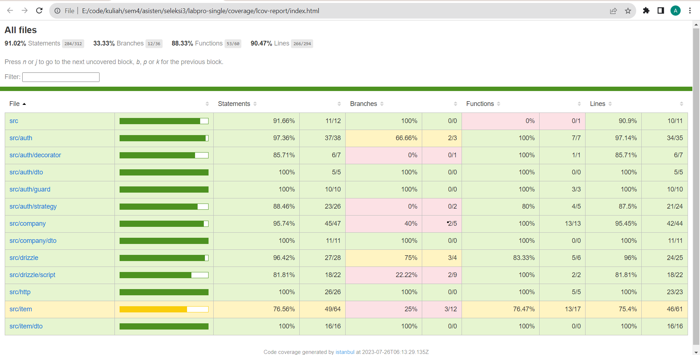

# Single Service OHL Labpro

Nama: Arsa Izdihar Islam

NIM: 13521101

## Deployment
Api ini sudah di-deploy pada [https://ohl-single.arsaizdihar.com](https://ohl-single.arsaizdihar.com) dengan api dokumen di [https://ohl-single.arsaizdihar.com/api](https://ohl-single.arsaizdihar.com/api)

## Tech stack
- NestJS
- Typescript
- DrizzleORM
- Zod

## How to run

1. Install docker
2. Jalankan `docker-compose -f docker-compose-dev.yml up -d --build`
3. Api akan berjalan pada port 3000. Buka http://localhost:3000/api untuk melihat dokumentasi api.

## Design patterns

1. Dependency Injection

Design pattern ini sangat dititikberatkan pada framework Nestjs yaitu pada module module-nya. Setiap bagian pada Nestjs dapat di-inject dengan suatu modul.

2. Repository Pattern

Design pattern ini digunakan untuk memisahkan antara business logic dengan logic untuk mengakses database. Repository pattern ini digunakan pada bagian service.

3. Factory Method dan Singleton

Metode ini digunakan untuk membuat koneksi database.

4. Decorator

Design pattern ini digunakan pada banyak bagian di NestJS. Digunakan baik pada class, method, maupun property untuk menambahkan fungsional.

## Endpoint
Keseluruhan endpoint dapat dilihat pada dokumentasi api yaitu di [https://ohl-single.arsaizdihar.com/api](https://ohl-single.arsaizdihar.com/api)

## Bonus
1. Deployment
  
Seperti yang disebut di atas, api ini sudah dideploy dengan menggunakan docker di VM DigitalOcean.

2. Dokumentasi API

Seperti yang sudah disebutkan juga, sudah terdapat dokumentasi api berupa Swagger docs.

3. SOLID
  
- S: Setiap modul memiliki fungsinya masing-masing. Misalkan service berisi business logic dan controller berisi logic untuk menghandle request.

- O: Pada bagian dto, schema validasi dapat di extend dengan .extend. Selain itu, service juga bisa ditambahkan fungsi-fungsi tanpa mengubah fungsi yang sudah ada.

- L: Bagian ini terlihat pada exception handling, yaitu keseluruhan class dan superclass memiliki karakteristik yang sama yaitu menerima error dan melakukan sesuatu untuk menghandle error tersebut dan mengembalikannya ke user.

- I: Pada Nestjs, modul-modul yang lain dapat diinjeksi asal suatu modul tersebut diberikan decorator injectable atau merupakan factory dsb.

- D: Pada bagian guard, dapat diimplementasikan dengan bergantung pada interface Guard dari NestJS.

4. Testing

Testing dibuat untuk setiap endpoint API dengan coverage sebagai berikut  yaitu line coverage sebesar 90.47%.

5. Fitur tambahan

Terdapat fitur count pada bagian get all barang dan juga fitur untuk search berdasarkan nama dan kode barang.

6. Kutu kode FE Admin

Saya sudah memberikan 2 PR pada bagian FE.